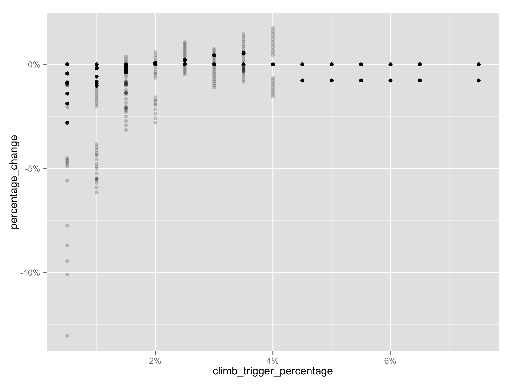
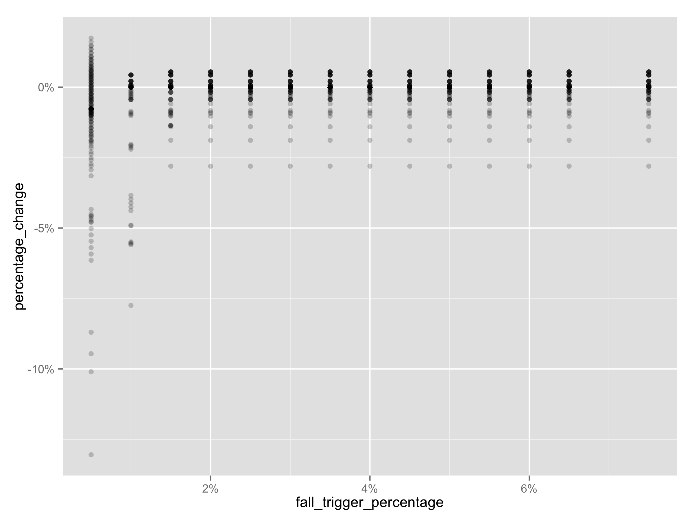
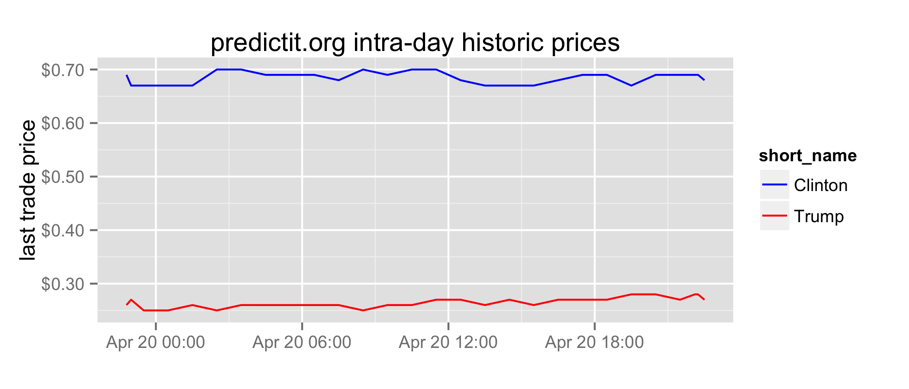

## Backtesting the Dow

My brother-in-law, Eric, and I were talking about investment strategies: specifically, if we buy the Dow Jones when prices fall and sell when prices climb, how much should the price change between transactions to maximize yield?

We collected some intra-day data for the SCHX ticker, which tracks the Dow Jones, between March 30th and April 22nd and backtested various scenarios. Obviously, three weeks of a single ticker is a very small sample.

We backtested various scenarios and used the Random Forest importance function to identify the most influential parameters:

                             IncNodePurity
    climb_trigger_percentage         0.168
    fall_trigger_percentage          0.129
    transaction_size                 0.075
    transaction_cost                 0.024

The climb trigger percentage was the most important feature. For our data sample, about 3% to 3.5% returns the highest yield:

The fall trigger percentage converged at just below zero at around 2%. 

We realize that our results may be over-fit, and so we'll re-visit this once we have more data. We should also capture data for other tickers to see if this generalizes.

## Prediction markets: 2016 election

I find prediction markets fascinating, and notice that predictit.org has made pricing accessible via API. My son, Miles, was curious to know if there are pricing differences throughout the day, (e.g. perhaps during peak internet activity times on the east and west coast we see more democrats online and the prices move in a predictable way). We started to collect some data to test our theory:

