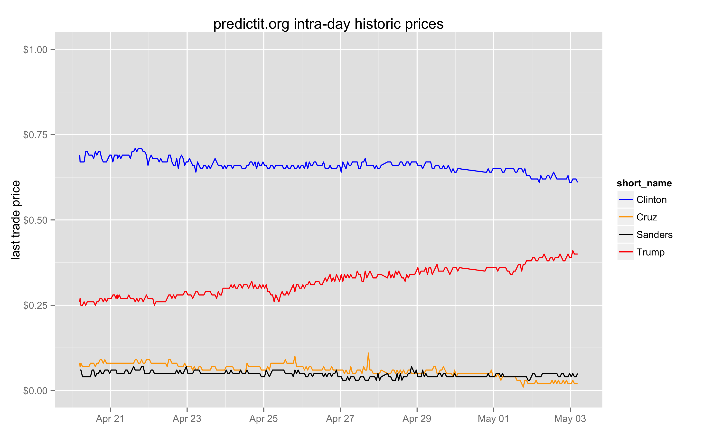

## Backtesting the Dow

My brother-in-law, Eric, and I were talking about investment strategies: specifically, if we buy the Dow Jones when prices fall and sell when prices climb, how much should the price change between transactions to maximize yield?

We collected some intra-day data for the SCHX ticker, which tracks the Dow Jones, between March 30th and April 29th and backtested various scenarios.

## Prediction markets: 2016 election

I find prediction markets fascinating, and notice that predictit.org has made pricing accessible via API.

My son, Miles, was curious to know if there are pricing differences throughout the day. Our hypothesis was that there may be predictable price swings at certain times of the day, since Democrats are more highly concentrated in the (vertical) coastal areas, and Republicans are more concentrated in the center. 

We thought that the price might swing, by some small but predictable amount, as the demographics of the active internet users changes throughout the day, e.g. a possible surge of democrats first thing in the morning, that swings back as the central southern states wake up. We started to collect some data to test our theory:

### What we saw ###

The prices generally don't fluctuate within more than a couple of cents over a 24 hour period. Given that there's a one-cent spread between the buy price and cell price, we need to see a movement of at least two cents to make any money. The price fluctuations were too small to trade, regardless of whether there's any intra-day seasonality.

